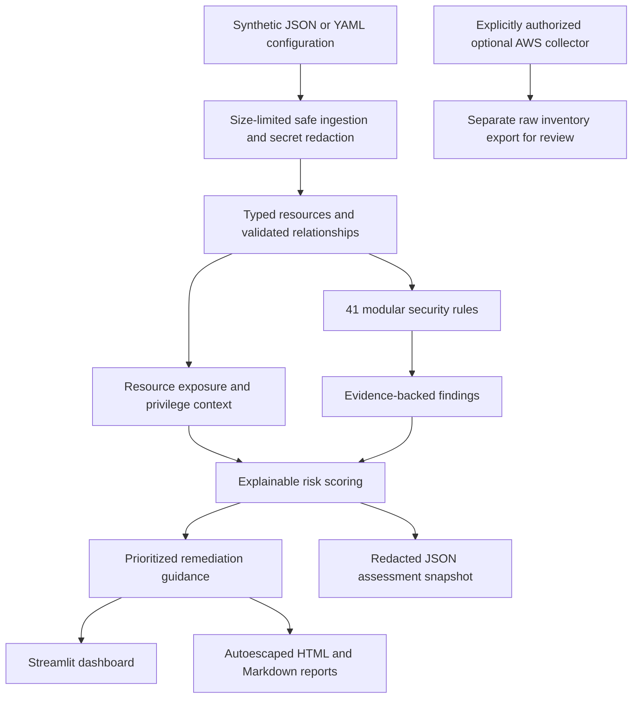

# CloudGuard — Cloud Security Misconfiguration & Risk Assessment Platform

**Analyze synthetic AWS-style configurations, explain contextual risk, and turn findings into a prioritized remediation plan.**

A functional, local defensive portfolio project for learning cloud security and demonstrating
configuration assessment skills. It is an educational scanner, not a production CSPM, penetration
testing tool, compliance certification or complete AWS policy evaluator.

## Problem statement

Fast-moving teams can leave powerful identities, permissive network rules and exposed data behind.
CloudGuard shows what is configured, why it deserves attention and how an owner should validate
and fix it. It does not mistake a configuration finding for evidence of an attack.

## Features

- **41 modular rules** across IAM, storage, networking, databases, compute, logging, secrets and governance.
- Four reproducible local environments: secure, startup, vulnerable and enterprise.
- Strict Pydantic normalization, JSON/YAML ingestion, reference validation and safe input limits.
- Stable finding IDs, masked evidence, contextual risk contributions and consistent severity thresholds.
- An inventory-normalized posture score and an ordered remediation queue.
- Streamlit dashboard with environment selection, charts, filters, evidence, guidance and report downloads.
- Autoescaped HTML and Markdown assessment reports with actual scan-result executive summaries.
- Optional, explicitly gated read-only boto3 security-group inventory export for a future authorized account.
- Automated positive/negative tests for every rule, plus ingestion, scoring, redaction, reports, CLI and UI.

## Architecture



The optional export is deliberately separate: it is not a full AWS-to-CloudGuard adapter and
cannot be passed directly to the synthetic scanner. No live account is accessed by demo, scan or dashboard.
FastAPI and SQLite are omitted because the dashboard can assess these small local inventories directly.
An atomic-per-file JSON snapshot provides reproducibility without an unnecessary API/database layer.

## Screenshots

Screenshot placeholder: `docs/images/dashboard-overview.png` — startup KPIs and remediation queue.
Screenshot placeholder: `docs/images/finding-detail.png` — evidence, risk contributions and remediation.
Capture these from the running local dashboard using synthetic data only.

## How scanning works

1. Load a bounded JSON/YAML file; reject unsafe YAML tags/aliases and malformed schemas.
2. Redact recognized secret fields and patterns before normalization and output.
3. Require explicit security settings rather than silently treating missing fields as secure.
4. Validate unique resource IDs and referenced policy/security-group types.
5. Apply matching rules to each resource, retain evidence and attach risk/impact/remediation guidance.
6. Sort findings by risk and calculate each resource's maximum unresolved risk.
7. Write the assessment and reports, or inspect the same calculations in Streamlit.

## Security checks

| Category | Rules | Examples |
|---|---:|---|
| IAM | 9 | Administrative grants, console MFA, wildcard policies, old/multiple keys, inactive privilege, broad trust, PassRole/launch combination, root-style keys |
| Storage | 8 | Public grants, anonymous read/write, confidential public data, public policy, legacy encryption, visibility and versioning |
| Network | 6 | Global IPv4/IPv6 SSH/RDP/database rules, all ingress, broad inbound range and unrestricted egress review |
| Database | 7 | Public addressing, confidential exposure, referenced group weakness, encryption, backups, deletion protection and logging |
| Logging | 5 | Disabled audit/monitoring, multi-region gap, integrity validation and retention |
| Compute | 3 | Volume encryption, IMDSv2 requirement and monitoring |
| Configuration | 2 | Missing owner/environment tags |
| Secrets | 1 | Nested sensitive field names and credential-like text, with redaction |

See [rule catalog](docs/rule-catalog.md) for every ID and implementation behavior.

## Risk and posture score

Finding risk = base severity points + applicable resource context, capped at 100.
Base points: LOW 10, MEDIUM 30, HIGH 55, CRITICAL 80.
Modifiers: public permission/path +15, declared admin +15, confidential data +10,
encryption gap +5, console MFA absent +10, visibility gap +5, high criticality +5.
Severity: LOW 0–29, MEDIUM 30–54, HIGH 55–79, CRITICAL 80–100.

**Cloud Security Score = 100 − ceil(mean highest unresolved finding risk per resource).**
Resources without findings contribute zero. Multiple findings on one resource do not multiply
its posture penalty. Accepted risks remain counted; resolved risks do not. The default scan
creates OPEN findings and does not persist a case-management workflow.

This is an educational prioritization model, not an industry-certified rating or breach probability.
Adding healthy resources can dilute a critical issue: always show severity counts and the remediation
queue alongside the score. [Complete scoring explanation](docs/scoring.md).

## Demonstration results

| Environment | Resources | Findings | Educational security score |
|---|---:|---:|---:|
| Secure | 10 | 0 | 100 |
| Startup | 10 | 20 | 46 |
| Vulnerable legacy mock | 10 | 43 | 22 |
| Enterprise | 40 | 4 | 98 |

Zero findings means no implemented rule triggered on the supplied inventory; it does not prove
complete security. The startup's 20 findings include 11 CRITICAL, 8 HIGH and 1 MEDIUM.
Findings are not independent vulnerabilities: the same resource can have related findings.

## Sample finding

`CG-IAM-002`: **Console identity without MFA**, resource `lab-startup-admin`.

- Evidence: console access true, MFA false, declared administrative grant true.
- Risk: **85/100 CRITICAL** = 55 base + 15 admin + 10 MFA gap + 5 criticality.
- Impact: a stolen password could permit console access if other controls do not intervene.
- Remediation: require phishing-resistant MFA, prefer federation, and review standing admin grants.
- Verify: export updated settings, rerun the rule and confirm intended access using authorized validation.

## Dashboard and reports

The dashboard shows seven KPIs and five chart views. Select an environment, filter severity,
resource type, category or status, then select a finding to inspect evidence and remediation.
An empty filter result is handled explicitly. Both HTML and Markdown reports are downloadable.
Charts use horizontal labels and integer axes. Public LinkedIn and GitHub-profile links are included.

The CLI writes `findings/latest-assessment.json`, `reports/cloud-security-report.html` and
`reports/cloud-security-report.md`. Rerunning a scan replaces these generated outputs.
Use `--output-dir` to retain separate assessment runs. Reports include executive summary,
overview, score, risk distribution, critical/high counts, affected resources, evidence,
prioritized actions, remediation, limitations and conclusion. Report HTML autoescapes input.

## Installation (Windows PowerShell, Python 3.12)

Open the **cloudguard** folder in VS Code. The prepared local `.venv` already has dependencies.
For a fresh checkout:

```powershell
python -m venv .venv
.\.venv\Scripts\python.exe -m pip install -r requirements-lock.txt
```

If your Python shortcut is broken, choose an installed Python 3.12 interpreter in VS Code.
Explicit virtual-environment paths avoid PowerShell activation-policy requirements.
On Linux/macOS replace `.\.venv\Scripts\python.exe` with `.venv/bin/python`.
Direct dependency pins are in requirements.txt; the lock file freezes the tested full environment.

## Usage

```powershell
# Regenerate fixtures and assess the startup demo
.\.venv\Scripts\python.exe -m cloudguard demo
# Assess the vulnerable configuration
.\.venv\Scripts\python.exe -m cloudguard scan environments/environment_vulnerable.json
# Generate only the four environment files
.\.venv\Scripts\python.exe -m cloudguard generate
# Keep a separate assessment output
.\.venv\Scripts\python.exe -m cloudguard scan environments/environment_secure.json --output-dir reports/secure-review
# Start the dashboard and keep this terminal open
.\.venv\Scripts\python.exe -m streamlit run dashboard/app.py --server.address 127.0.0.1 --server.port 8503
```

Dashboard: **http://127.0.0.1:8503**. Port 8503 avoids the AetherSOC dashboard on 8501.
Stop Streamlit with Ctrl+C. A refused connection usually means the server is not running.
The dashboard re-assesses local files directly; it does not overwrite the CLI report automatically.
The generator replaces only its four known synthetic fixture files. Keep custom environments separately.

## Tests and lint

```powershell
.\.venv\Scripts\python.exe -m pytest -q
.\.venv\Scripts\python.exe -m ruff check cloudguard dashboard scripts tests
.\.venv\Scripts\python.exe -m scripts.validate_dashboard
```

Tests include positive/negative cases for all 41 rules, IPv4/IPv6 network semantics, scoring edges,
reference validation, masking, HTML escaping, CLI processes and dashboard selection/filters.
The optional AWS gate is tested with a fake SDK, never a real account.
Read [local validation](docs/validation.md) for final counts and runtime-check evidence.

## Project structure

```text
cloudguard/
  ingestion/         bounded JSON/YAML loader and redaction boundary
  models/            strict resources, findings and assessment
  rules/             IAM/storage/network/compute/database/logging/secrets/configuration
  scoring/           contextual risk and inventory posture formula
  remediation/       urgency, principles and verification guidance
  reporting/         autoescaped HTML template and Markdown generation
  integrations/      opt-in read-only inventory collector
dashboard/           local Streamlit workspace and chart helpers
environments/        four reproducible mock inventories
findings/, reports/  generated outputs, ignored by Git
docs/                learning, interview, scoring, demo, AWS design and resume guides
tests/               automated positive, negative and integration cases
scripts/             fixture generation, dashboard launcher and live HTTP validation
```

## Security boundaries and limitations

No AWS access occurs during local analysis. No attacks, scans of unauthorized infrastructure,
credential testing, writes to cloud resources or automated remediation occur. The optional
collector requires explicit matching account confirmation and verifies STS identity before inventory reads.
It exports only raw security-group inventory; full live scanning remains future work.

IAM checks inspect declared unconditional Allow statements; they do not resolve effective access
across denies, SCPs, boundaries, resource policies or sessions. Network findings distinguish
permitted source ranges from proven service reachability. Block Public Access is a single simplified
effective guardrail boolean in the mock model, not the four AWS settings. The unencrypted-bucket fixture
is a legacy/general storage model: modern S3 encrypts new uploads by default.

No formal CIS/NIST/OWASP compliance IDs are claimed. Mappings describe verified AWS best-practice
concepts. Key age, retention and broad-port thresholds are lab baselines, not universal mandates.
Missing inventory cannot be assessed; the tool does not discover omitted resources.
Redaction recognizes common fields/patterns but cannot guarantee detection of arbitrary secrets.
The dashboard has no authentication; keep it on loopback. [SECURITY.md](SECURITY.md).

## Roadmap and what I learned

Next: a complete authorized AWS normalization adapter, effective-permission analysis, versioned
inventory provenance, exception approvals, durable finding state, remediation diffs and coverage metrics.

I learned how normalization separates provider formats from rules, how identity and network boundaries
interact, why metadata is not exploitation evidence, how context changes priority and why evidence and
verification must accompany remediation. Start with [learning guide](docs/learning-guide.md), then
[interview guide](docs/interview-guide.md), [recruiter demo](docs/recruiter-demo.md) and
[resume material](docs/resume-material.md).
